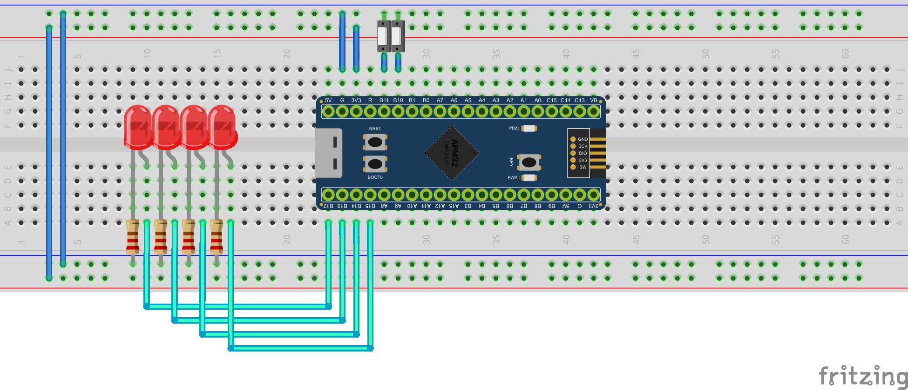

# Tutorial 1: Inputs, Outputs, and Combinational Logic

**Objective:** Understand GPIO pin configuration at the register level and apply a truth table for conditional turning on of actuators (LEDs) using binary sensors (Buttons).

**Based on the Fritzing Diagram:**


- **Sensor 1 (Button 1):** `PB10`
- **Sensor 2 (Button 2):** `PB11`
- **Actuator 1 (LED 1):** `PB12`
- **Actuator 2 (LED 2):** `PB13`
- **Actuator 3 (LED 3):** `PB14`
- **Actuator 4 (LED 4):** `PB15`

---

## Proposed Truth Table

We will implement the following logic in our main infinite loop:

|   Button 1 (PB10) |   Button 2 (PB11) | Action Required                                                     |
| :---------------: | :---------------: | :------------------------------------------------------------------ |
| 0 (Not pressed)   | 0 (Not pressed)   | **All LEDs OFF.**                                                   |
|  1 (Pressed)      | 0 (Not pressed)   | Turn ON **LED 1 & 2** (`PB12`, `PB13`). Rest OFF.                   |
| 0 (Not pressed)   |  1 (Pressed)      | Turn ON **LED 3 & 4** (`PB14`, `PB15`). Rest OFF.                   |
|  1 (Pressed)      |  1 (Pressed)      | **All LEDs ON.**                                                    |

*(We will assume inverted logic on the buttons due to pull-up resistors, which means "Pressed" equals a logic low level / `0`).*

---

## Step 1: Configuring Registers in `main.c`

Every time you interact with a pin, you must answer three questions:

1. Which Port does it belong to, and is its clock enabled in `RCM`?
2. Is it a low pin (0 to 7) configured in `CFGLOW`, or a high pin (8 to 15) configured in `CFGHIG`?
3. What hex code configures it as an Input / Output?

Insert the following code inside the `/* USER CODE BEGIN Init */` block:

```c
/* USER CODE BEGIN Init */

// 1. ENABLE CLOCK FOR PORT B
RCM->APB2CLKEN |= (1 << 3); // Enable Port B (Bit 3)

// 2. CONFIGURE EVERYTHING IN CFGHIG AT ONCE
// In this setup, ALL our connections are in the upper half of Port B.
// Buttons: PB10, PB11 (Bits 8 to 15 in CFGHIG) -> Inputs with Pull-Up (0x8)
// LEDs: PB12, PB13, PB14, PB15 (Bits 16 to 31 in CFGHIG) -> 50MHz Outputs (0x3)

// Clear the upper 24 bits of CFGHIG (corresponding to PB10-PB15)
GPIOB->CFGHIG &= ~(0xFFFFFF << 8); 

// Assign the configuration: 0x3333 for the LEDs and 0x88 for the buttons
GPIOB->CFGHIG |= (0x333388 << 8);

// 3. ACTIVATE PULL-UPS FOR THE BUTTONS
// Sending a "1" to the ODATA register on input pins activates the internal Pull-Up resistor
GPIOB->ODATA |= (1 << 10) | (1 << 11); 

/* USER CODE END Init */
```

---

## Step 2: Reading and Implementing Control Logic

Now that the hardware has been programmed to obey us, we proceed to the infinite loop (the core program). In each cycle, we will read the state of `PB10` and `PB11` using the `IDATA` register and apply the decision based on our truth table.

Insert this inside the `/* USER CODE BEGIN While */` block:

```c
        /* USER CODE BEGIN While */

        // 1. Read Inputs
        // To check a specific bit we use: (Register & (1 << BitIndex))
        // Since we use internal Pull-Ups, if the button is pressed, the value drops to 0.
        int button1_pressed = !(GPIOB->IDATA & (1 << 10));
        int button2_pressed = !(GPIOB->IDATA & (1 << 11));

        // 2. Clear all LEDs first (to keep the IF statement short)
        GPIOB->ODATA &= ~((1 << 12) | (1 << 13) | (1 << 14) | (1 << 15));

        // 3. Apply Multiple Conditions
        if (button1_pressed && button2_pressed) {
            // Turn all ON = Send 1 to the ODATA register for all 4 pins
            GPIOB->ODATA |= (1 << 12) | (1 << 13) | (1 << 14) | (1 << 15);
        }
        else if (button1_pressed) {
            // Turn ON only PB12 and PB13
            GPIOB->ODATA |= (1 << 12) | (1 << 13);
        }
        else if (button2_pressed) {
            // Turn ON only PB14 and PB15
            GPIOB->ODATA |= (1 << 14) | (1 << 15);
        }
        // The 'else' case (neither pressed) requires no code because we already turned them OFF in step 2!

        /* USER CODE END While */
```

## Baremetal Behavior Summary

As you can see, **there are no functions** like `digitalRead()` or `pinMode()`. The code interacts physically by altering base memory transistors (registers) at extreme speeds. This is the heart of real embedded programming!
