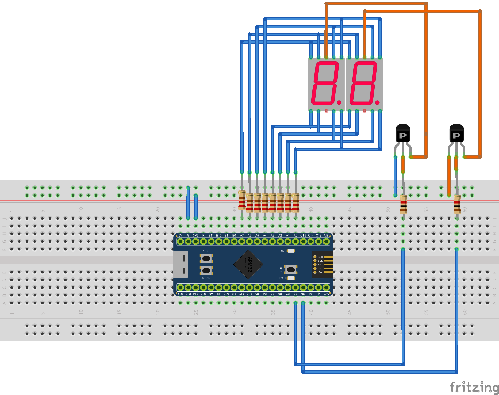

# Tutorial 2: Multiplexing Two 7-Segment Displays

**Objective:** Command whole-register manipulations and master **time multiplexing** by controlling two 7-Segment Displays simultaneously using Persistence of Vision (PoV).

**Based on the Fritzing Diagram:**


This setup is a **Multiplexed Common Anode** system. 
*   **Data Bus (Segments):** Pins `PA0` to `PA7`. Being Common Anode, individual segments turn ON when we apply a logic `0` (GND) to them.
*   **Digit Selectors (PNP Transistors):** Pins `PB8` and `PB9`. Being PNP transistors, they act as switches throwing VCC into the Common Anode when a logic `0` is applied to their bases.

> [!NOTE]
> **Hardware Variation: LDS-5261DS (Dual Output Module)**
> If you are using the compact 10-pin **LDS-5261DS** dual 7-segment display (or similar):
> * **It is Common Cathode.** It shares the ground (`-`), not the VCC.
> * **Wiring:** The common digit selection pins on this display are **Pin 8 (Digit 1)** and **Pin 7 (Digit 2)**. You can connect `PB8` and `PB9` directly to these display pins (omitting the PNP transistors) to act as current sinks.
> * **Code Adaptation:** Because it is Common Cathode, segments turn ON with a logic `1`. You must remove the bitwise negate operator (`~`) when loading data into Port A in your `while(1)` loop. (e.g., use `(nums[5] & 0xFF)` directly instead of `(~nums[5] & 0xFF)`). Writing `0` to the Common pins (`PB8` / `PB9`) will still successfully activate that digit by pulling the current to Ground!

---

## 1. The Display Alphabet

We will save the logical pattern for each number from 0 to 9 in an array. In positive logic, a '0' (`0b00111111` = `0x3F`) lights up segments A, B, C, D, E, F. We will bitwise negate (`~`) this pattern in the code when sending it to the port to fit our inverted connection.

Declare this before the `main` function in your `main.c`:

```c
/* USER CODE BEGIN Private Functions */

// Bit structure: 0b0gfedcba
// A6=g, A5=f, A4=a, A3=b, A2=e, A1=d, A0=c
const uint8_t nums[10] = {
    0x3F, // 0 -> 0b00111111
    0x09, // 1 -> 0b00001001 
    0x5E, // 2 -> 0b01011110
    0x5B, // 3 -> 0b01011011
    0x69, // 4 -> 0b01101001
    0x73, // 5 -> 0b01110011
    0x77, // 6 -> 0b01110111
    0x19, // 7 -> 0b00011001
    0x7F, // 8 -> 0b01111111
    0x7B  // 9 -> 0b01111011
};

/* USER CODE END Private Functions */
```

---

## 2. Super Fast Configuration

Since we are strictly using the 8 lowest pins of Port A, we can configure all of them at once with a single instruction (rather than bit-by-bit masking). Then, we will configure `PB8` and `PB9` individually.

Add this inside `/* USER CODE BEGIN Init */`:

```c
/* USER CODE BEGIN Init */

// 1. Enable Clocks for Port A and Port B
RCM->APB2CLKEN |= (1 << 2) | (1 << 3);

// 2. Configure pins PA0 to PA7 as Push-Pull Outputs (0x3)
// A 32-bit number holds exactly 8 bundles of 4-bit configurations. 
// To turn the entire CFGLOW into outputs, we write 0x3 repeated 8 times.
GPIOA->CFGLOW = 0x33333333;

// 3. Configure digit selectors PB8 and PB9 as Push-Pull Outputs (0x3)
// PB8 and PB9 are the LOWEST pins of CFGHIG (bits 0 to 7)
GPIOB->CFGHIG &= ~(0xFF << 0);
GPIOB->CFGHIG |=  (0x33 << 0);

// 4. Turn OFF the displays (Turn off the PNP transistors by sending a 1 to their ports)
GPIOB->ODATA |= (1 << 8) | (1 << 9);

/* USER CODE END Init */
```

*(Note: In real embedded programming, knowing how to overwrite the complete `CFGLOW` with `0x33333333` saves dozens of CPU clock cycles compared to using heavy, generic HAL functions).*

---

## 3. Main Loop: Persistence of Vision

To display a number like "85", our MCU must perform:
1. Turn OFF both transistors.
2. Write the "5" data to `PORTA`.
3. Turn ON the Units transistor and wait 5ms.
4. Turn OFF both transistors.
5. Write the "8" data to `PORTA`.
6. Turn ON the Tens transistor and wait 5ms.

If we iterate through this process at extreme speeds (an infinite loop inside `while(1)`), visually, both digits will appear illuminated simultaneously. That trick is known as **Multiplexing**:

Insert this inside `/* USER CODE BEGIN While */`:

```c
        /* USER CODE BEGIN While */
        
        // --- DIGIT 1 (Units) ---
        // 1. Prevent "ghosting effect" by turning OFF all selectors
        GPIOB->ODATA |= (1 << 8) | (1 << 9); 
        
        // 2. Load the data. We invert using "~" because it's Common Anode (turns on with 0).
        // And we mask with "& 0xFF" to avoid altering any high pins on Port A.
        GPIOA->ODATA = (GPIOA->ODATA & ~0xFF) | (~nums[5] & 0xFF);
        
        // 3. Turn ON the Units transistor (PB8) by writing a 0 to it.
        GPIOB->ODATA &= ~(1 << 8);
        
        // 4. Wait around 3 to 5ms. A longer duration creates a noticeable visual flicker.
        delay_ms(5); 

        // --- DIGIT 2 (Tens) ---
        // 1. Prevent "ghosting effect" by turning OFF all selectors.
        GPIOB->ODATA |= (1 << 8) | (1 << 9); 
        
        // 2. Load the data for the number 8 (for example).
        GPIOA->ODATA = (GPIOA->ODATA & ~0xFF) | (~nums[8] & 0xFF);
        
        // 3. Turn ON the Tens transistor (PB9) by writing a 0 to it.
        GPIOB->ODATA &= ~(1 << 9);
        
        // 4. Keeping the retina fooled.
        delay_ms(5);

        /* USER CODE END While */
```
